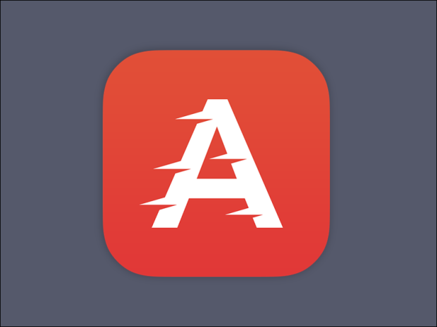

# Examples app


Paw application example.

# Development
## Node app setup

**Clone it outside core application to avoid build conflicts**

```shell
git clone git@code.plugandwork.net:plugandwork.app/example_app.git
cd example_app
npm install
npm run-script build
```

## Rails app setup

⚠️⚠️⚠️ When app is zipped go to core server and start it with `rails s` ⚠️⚠️⚠️

Then push your app to the backend like this

```shell
curl --location --request POST 'https://localhost:3000/api/d2/apps/publish' \
--header 'Authorization: Bearer token_value' \
--form 'file=@"/path/to/example_app/bundle.zip"'
```


## Live reload
After installed app on core server, you can replace as follow inside [package.json of core](https://code.plugandwork.net/plugandwork/core/-/blob/develop/frontend/package.json)

```diff
{
  "dependencies": {
    - "example": "file:view_app_modules/example_app",
    + "example": "file:../../relative_path/to/example_app",
  }
}
```

Then run `npm install`

Now, you can run `npm start` into example app folder to watch changes, then frontend autorefesh !

# Publish app
To publish app on paw store, run following request

```shell
curl --location --request POST 'https://store.plugandwork.fr/api/d2/apps/publish' \
--header 'Authorization: Bearer token_value' \
--form 'file=@"/path/to/example_app/bundle.zip"'
```
